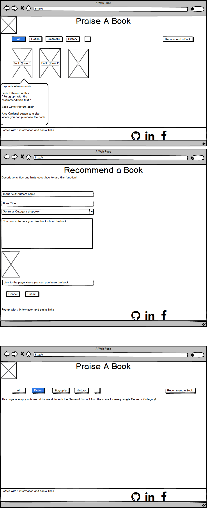

# Praise a Book - Third milestone project

[View my project](https://praise-a-book.herokuapp.com/)

This website was made as my third Milestone project at [Code Institute](https://codeinstitute.net/).
The main goal was to create full stack web application and follow the newest UX/UI principles and create different 
layers thereby as a user I can store/modify and reach data from remote database. 

The idea was to build a book review and recommendation site. 
Create a web application that allows users to upload details of books, including book title, author name, link to cover image and any other relevant fields as genre and write a review as a recommendation.
Create the backend code and frontend form(s) to allow users to add new books and reviews to the site, edit them and delete them.

## UX
First I chose the background picture for the page title which is some "old" books on a bookshelf, after that it was easier to pick a color scheme, to make the resemblance to a library. 
The website is responsive, so it gives the same excellent user experience while you use it on a PC, tablet or mobile device with the same functionality.

### Colors

 - Buttons:
    - Green button : apply modifications on the web page
        - Update and Submit buttons
    - Red button : delete the chosen data from the database
        - Delete button
    - Clear button : step back to the recent page of the application without doing any modification
        - Cancel buttons
        
 - Toast messages:
    - Have very different background color from the main page color to make it pop out because we get these messages when we done some actions or modifications with the data in the database.
    
 - Modal box:
    - A pop up verification box with a red delete button, verifying the will of the user to delete data from the database
    
### Icons

I imported icons from the [font awesome](https://fontawesome.com/) 

 - Icons:
    - Social icons in the footer (Facebook, GitHub, LinkedIn)
    - Submit and Update button icon (check)
    - Cancel button icon (left arrow)
    - Delete button icon (trash can)      
    

### Responsive
   
The application is convenient to use on every resolution (Mobile/Tablet/PC)

### Mockup
#### Front end Mockup

- **Created with [Balsamiq Mockups 3](https://balsamiq.com/) that is a user interface design tool**
    - **Desktop view**:
    
    - **Ipad view**:
    [Ipad view](Balsamiq/Mockup_Pictures/Ipad_view.png)
    - **Mobile view**:
    [Mobile view](Balsamiq/Mockup_Pictures/Mobile_view.png)   
    
### User Stories

#### UI/UX

- As a user, I want to see the favicon on every page
- As a user, I want to see the buttons in reasonable colors (red, green or clear(white))     
- As a user, I want to see the hover effect on navigation elements, on the scroll up to top button, on the social media icons as well as on the book cover pictures
- As a user, I want ot ba able to click on the social links so that it can be open in a new tab
- As a user, I wan to see the fonts in this order: 'Lato', Calibri, Arial, sans-serif

#### Database

- As a user, I want to store the data into the database so I can reach the data later on

#### Main functionalities:

- As a user, I want to see all the already stored and recommended books on the home page
- As a user, I want to see the already recommended books ordered by Genre in different pages
- As a user, I want to see the book title, the name of the author and the review about a certain book if I click on the chosen books cover picture 
- As a user, I want to be able to create a new book recommendation by filling out a form
- As a user, I want to be able to update an already recommended book's details by clicking on the cover picture and choosing the update option
- As a user, I want to be able to delete an already recommended book by clicking on the cover picture and choosing the delete option
- As a user, I want to get a pop up question to verify my choice of deletion
- As a user, I want to see a "toast" message every time I do any kind of modification on the database or on the already created recommendations
- As a user, I want to be able to scroll to top with a simple click on button, instead of actually scrolling to the top
- As a user, I want to see tha latest recommendation on the top of the page as the first item
- As a user, I want to get back to the main page after I did any kind of modification on the database
- As a user, I want to see notification if I miss any kind of mandatory input on the recommendation or update form

#### Toast messages 

- As a user, I want to get messages if:
    - I created something
    - I updated something
    - I am about to delete something or already deleted something

#### Responsiveness

- As a user, I want to use the website on Pc, Tablet and Mobile Phone so that on different devices it will work with the same functionality.
- As a user, I want to see a hamburger menu instead of the standard navigation bar for mobile size resolutions

## Features
### Existing Features

- Responsive web application
- Store data in Mongo DB database
- Create a new book recommendation
- Update any previously added book
- Delete book recommendation
- Client side validation
- Server side validation
- Sorted the books by Genre
- Scroll to top button
- Social link in the footer to contact 

### Features Left to Implement
- Add a link that you could conceivably earn money from people looking to buy the book
- Less books displayed on a smaller resolution device, pagination

## Technologies Used

- [HTML5](https://www.w3.org/html/)
    - Hypertext Markup Language is the standard markup language for creating web pages and web applications.
- [CSS3](https://www.w3.org/Style/CSS/)
    - Cascading Style Sheets is a style sheet language used for describing the presentation of a document written in a 
    markup language like HTML.
- [BootStrap 4.4.1](https://getbootstrap.com/docs/4.4/)
    - Front End Framework for developing responsive websites.
- [JavaScript](https://developer.mozilla.org/en-US/docs/Web/JavaScript)
    - JavaScript is a lightweight interpreted or just-in-time compiled programming language with first-class functions. While it is most well-known as the scripting language for Web pages.
- [JQuery 3.2.1](https://jquery.com)
    - The project uses to simplify DOM manipulation.
- [Git](https://git-scm.com/)
    - Git is a distributed version-control system for tracking changes in source code during software development.
- [GitHub](https://github.com/)
    - GitHub Inc. is a web-based hosting service for version control using Git.
- [Flask](https://palletsprojects.com/p/flask/)
    - Flask is a micro web framework written in Python. It is classified as a microframework because it does not require particular tools or libraries. It has no database abstraction layer, form validation, or any other components where pre-existing third-party libraries provide common functions
- [Python](https://www.python.org/)
    - Python is an interpreted, high-level, general-purpose programming language
- [Heroku](https://www.heroku.com/)
    - Heroku is a platform as a service (PaaS) that enables developers to build, run, and operate applications entirely in the cloud
- [MongoDB](https://www.mongodb.com/)
    - MongoDB is a cross-platform document-oriented database program. Classified as a NoSQL database program, MongoDB uses JSON-like documents with schema. MongoDB is developed by MongoDB Inc. and licensed under the Server Side Public License (SSPL).
- [Jinja2](https://palletsprojects.com/p/jinja/)
    - Jinja is a web template engine for the Python programming language. Jinja2 is a modern and designer-friendly templating language for Python, modelled after Django's templates.

## Testing

### UI/UX

- Scenario: As a user, I want to see the favicon on every page
    - I am navigating to the <site_name> page
    - I can see the favicon on the tab of the <site_name> page

|site_name|
|:---------:|
|All     |
|Fantasy |
|Horror   |
|Thriller   |
|Recommend a book   |
|Update   |

- Scenario: As a user, I want to see the buttons in reasonable colors (red, green or clear(white))

    - The red color buttons are for the deleting function
        - On the main page:
            - I click on any of the book covers
            - I can see that the delete button is red
            - I click on the delete button 
            - I get a pop up box which asking for the verification of my decision to delete the chosen book
            - The verifying delete button is red as well
            - The cancel button is white
            
    - The white or clear buttons are for the back navigation
        - On the main page:
            - I can click on any of the book cover
            - I can see that the update button is white/clean
            - I can click on the update button
            - It will bring us to the filled out recommendation form connected with the chosen books data
            - I can see at the end of the form a cancel button 
            - The cancel button is white
            - The update button is green
            
        - On the Recommend a book page:
            - I can click on the navbar Recommend a page link
            - It will bring us to the recommendation site form
            - There is a cancel button at the end of the form which is white 
            - The submit button is green
               
- Scenario: As a user, I want to see the hover effect on navigation elements, on the scroll to top button, on the social media icons as well as on the book cover pictures

     - I am navigating to the landing page
     - I can go over the <effected_elements> 
     - I can see the hover effect over the icons

|effected_elements|
|:---------:|
|All|
|Fantasy |
|Horror|
|Thriller|
|Recommend a book|
|Update|
|Scroll to top button|
|Facebook|
|GitHub |
|LinkedIn  |

- Scenario: As a user, I want to be able to click on the social links so that it can be open in a new tab
    - I click on the <social_link> social link and the page will open in a new tab
    
|social_link|
|:---------:|    
|Facebook|
|GitHub |
|LinkedIn  |   
    

### Main functionalities:

- Scenario: As a user, I want to see all the already stored and recommended books on the home page

    - I open the main page
    - I can see the previously added books

- Scenario: As a user, I want to see the already recommended books ordered by Genre in different pages

    - I open the main page
    - I click on <genre> link on the navigation bar
    - I can see on different pages the books with the correct genre
    
|genre|
|:---------:|    
|Fantasy|
|Horror|
|Thriller|     

- Scenario: As a user, I want to be able to create a new book recommendation by filling out a form

    - When I go to the Recommend a book page I can see a form
    - I fill out this form and click on the submit button
    - I get back to the landing page and I can see the my previously recommended book as a first item in the list
    - I get a toast message about creating a new book

- Scenario: As a user, I want to be able to update an already recommended book's details by clicking on the cover picture and choosing the update option

    - on the main page I click on the chosen books cover
    - I click on the update button
    - I will see an already filled out form of the book with the previously added information in the fields
    - I gan change any input in any fields
    - When I click on the submit button it brings be back to the index page
    - I get a toast message about the update

- Scenario: As a user, I want to be able to delete an already recommended book by clicking on the cover picture and choosing the delete option

    - I pick a book and click on the cover picture
    - I click on the delete button
    - I get a pop up box with a question if I really want to delete the book from the database
    - I click on the Delete button
    - I get back to the main page (the book is deleted)
    - I get a toast message about that I deleted the book

- Scenario: As a user, I want to get a pop up question to verify my choice of deletion

    - I pick a book and click on the cover picture
    - I click on the delete button
    - I get a pop up box with a question if I really want to delete the book from the database
    - I click on the Cancel button
    - I get back to the main page

- Scenario: As a user, I want to see a "toast" message every time I do any kind of modification on the database or on the already created recommendations

    - I have been covered all the possibilities of the toast messages in previous test cases (recommendation, update, delete)

- Scenario: As a user, I want to be able to scroll to top with a simple click on button, instead of actually scrolling to the top

    - I am on the <site_name> page when I have more recommended books, I can see a scroll to top button
    - I click on the scroll to top button and it brings me back to the top of the page 
    
|site_name|
|:---------:|
|All     |
|Fantasy |
|Horror   |
|Thriller   |    

- Scenario: As a user, I want to see tha latest recommendation on the top of the page as the first item

    - On the Recommend a book site I fill out the form
    - Click on the submit button
    - I get back to the main site
    - I can see my previously recommended book as a first item

- Scenario: As a user, I want to see notification if I miss any kind of mandatory input on the recommendation or update form

    - Client side validation:
        - I don't fill out any of the fields in the forms (recommendation or update)
        - I get back an error message
        
    - Server side validation: (if the required attributes are deleted in the HTML)
        - I don't fill out any of the fields in the forms (recommendation or update)
        - The page reload itself
        - I get back an error toast message
           

    
### Responsiveness

- Scenario: As a user, I want to use the website on Pc, Tablet and Mobile Phone so that on different devices it will work with the same functionality.

    - I open the application on different devices ( PC, Tablet, Mobile )
    - I am able to use all the functionalities 

- Scenario: As a user, I want to see a hamburger menu instead of the standard navigation bar for mobile or tablet size resolutions

    - I open the application on different devices ( Tablet, Mobile )
    - I can see the navigation bar different as a hamburger menu
    - Clicked on it I can see my options I can choose from to navigate between the pages  

### Validation
- Checked my code with PEP8 and CSS validator

## Deployment

How I implement this project:

Firstly I built the basic functionality one of my private repository until I get the first working version of website. 
After this I copied the code snippets in this public repository, and explained the actual small pieces of the commits in the commit comment section.

- **Set up**:
    - I use local IDE for create the project, I installed the Git locally and synchronized my local IDE 
    with the local git. I use IntelliJ Pycharm for the front end development with its helpful built in deployment tools. 
    After I created a Git and GitHub repository, I could start to work and I could test my features locally.
    I could see my changes locally to start my application with my local IDE.
    Here I could choose the required browser which I want to use. (Chrome, Mozilla, etc.)
- **Commits**:
    - After every small piece and increment, I made commit to my local Git repository. After that in the end of the 
    bigger section that gives value to my project I pushed my modification to my online GitHub repository.
    - For the development I only use one branch called "master".
- **Local and online deployment**
    - Locally: It is very easy to clone repository from my account if you follow these steps:
        1. Follow this link [Project GitHub repository](https://github.com/TimeaKovacs86/PraiseABook) 
        2. Under the repository name, click "Clone or download".
        3. Here you have to copy the url's of the repository
        4. In your local IDE you can choose to create new project from version control/Git 
        5. Paste the link there that you copied before
        6. For additional help you can more information under this [link](https://help.github.com/en/articles/cloning-a-repository)
    - Online:
        1. I used Heroku:
        2. Create project with unique name
        3. I choose the project and under the Deploy tab I connect the github project where the source code are
        4. Set the deployment to Autodeploy so after every commit there will be a new deployment into Heroku.
        5. Create requirements.txt file: pip freeze > requirements.txt (In this way the Heroku will know what kind of 
        extensions should be installed)
        6. I set the Config Vars under the Settings (IP=0.0.0.0, PORT=5000, DB connection details, Secret key)
        7. The application up and running and available under this [link](https://praise-a-book.herokuapp.com/)
        
        
## Media
 - Favicon [link](https://icons8.com/icons/set/books-favicon)
 - Page title background picture [link](https://images.wallpaperscraft.com/image/books_shelf_library_123516_2560x1080.jpg)   
 
## Open Source Code
  The following links will show the open source code what I used to create my layout with just a few modifications what I marked with comments in the exact part of the code: 
 - https://github.com/louisremi/jquery-smartresize
 - https://louisremi.mit-license.org/
 
 - https://github.com/desandro/imagesloaded
 - https://desandro.mit-license.org/  